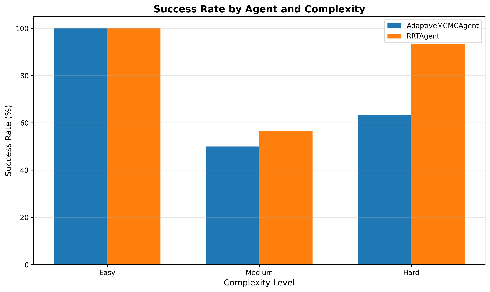
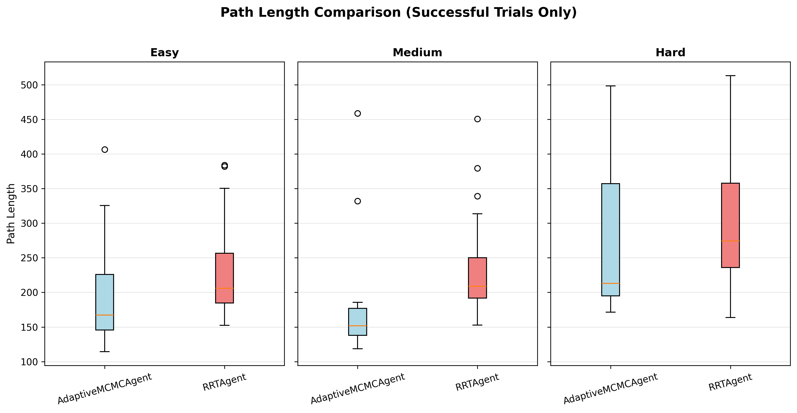
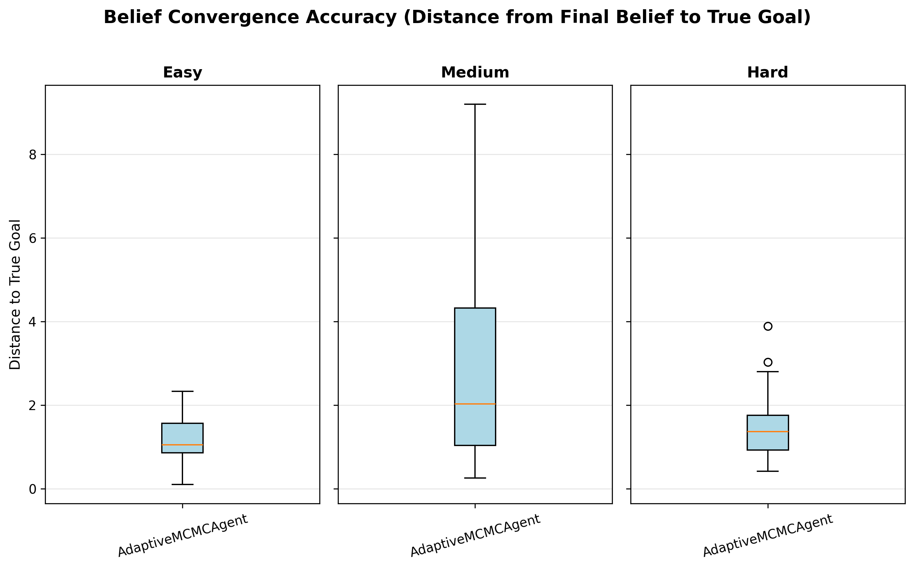
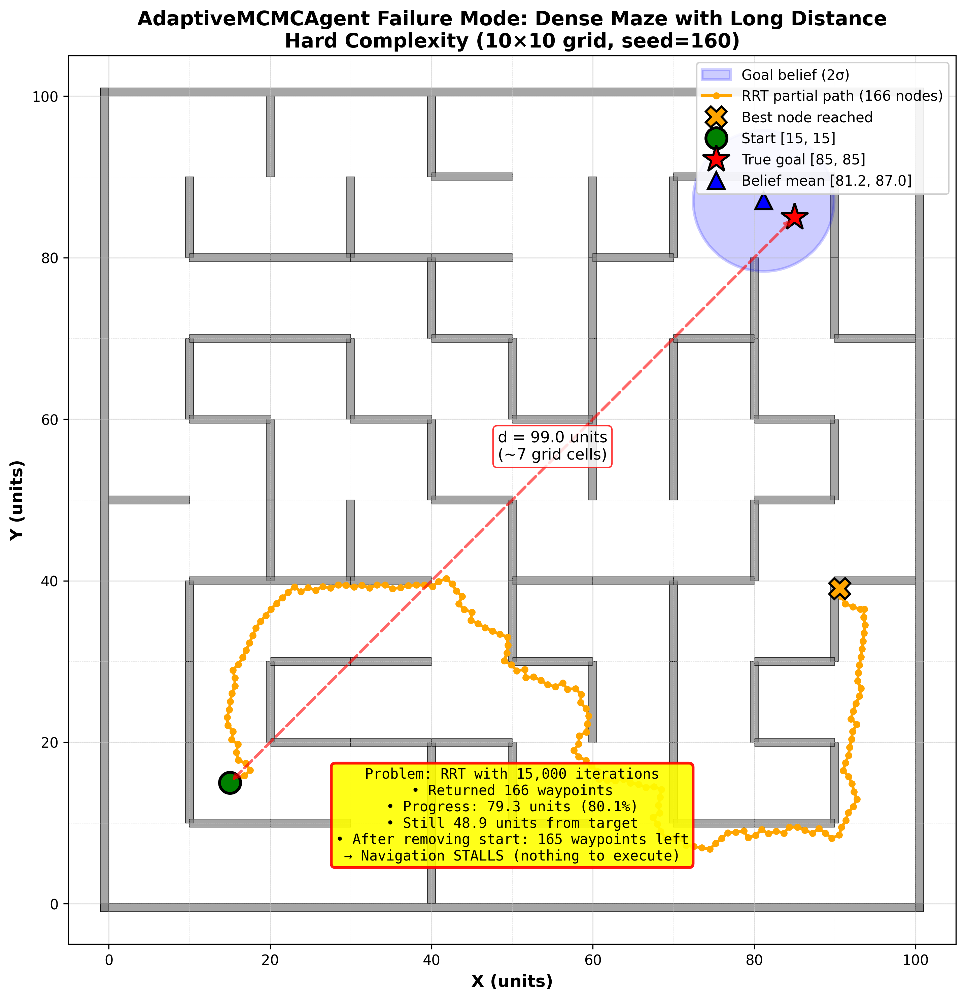
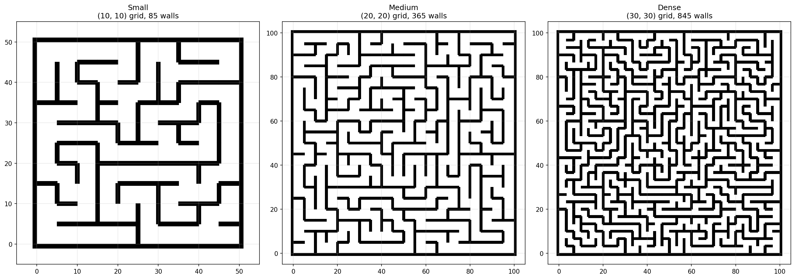

# MCMC-Guided RRT

**When a robot doesn't know where the goal is, should it plan toward its best guess — or toward the places that would tell it where the goal actually is?**

Standard sampling-based motion planners assume the goal is a known point. This project removes that
assumption. The robot starts with a diffuse Gaussian belief over the goal location (σ = 20 units in a
100 × 100 maze) and receives only **noisy range observations that get more accurate as it gets closer**.
It has to localize the goal and plan a path to it at the same time — and the two objectives pull in
different directions.

The planner is an RRT whose sampling distribution is a **Metropolis-within-Gibbs MCMC chain** targeting
a Boltzmann distribution over configuration space, mixed with uniform sampling to preserve
probabilistic completeness. The cost function that chain targets includes an **information-gain term**,
so the sampler is pulled toward regions where an observation would most sharply reduce goal
uncertainty — active perception, not just goal seeking.

Evaluated over **180 head-to-head trials** (30 mazes × 3 difficulty levels × 2 agents) against a
uniform-sampling RRT baseline.

---

## Headline Findings

| # | Question | Method | Finding |
|---|---|---|---|
| **1** | Does belief-guided sampling find **better paths**? | Mann-Whitney U + Cohen's d on successful trials | **Yes, and significantly.** Mean path length 193 vs 231 (easy, p = 0.0032) and 184 vs 241 (medium, p = 0.0015). Medium effect sizes (d = −0.55, −0.66). On hard mazes the gap narrows to 278 vs 301 and is **not significant** (p = 0.18). |
| **2** | What does it **cost**? | Mann-Whitney U on wall-clock time | **8–22× slower, with large effect sizes at every level.** 16.8s vs 1.6s (easy), 140s vs 21s (medium), **425s vs 20s** (hard); all p < 0.0001, Cohen's d = 0.87 / 0.84 / 1.23. The MCMC chain pays for path quality with compute. |
| **3** | Is it **more reliable**? | χ² test on success counts | **No — it is worse on hard mazes.** 63.3% vs 93.3% (χ² = 6.28, **p = 0.012**). Easy is a tie at 100%; medium is 50% vs 57% and not significant (p = 0.80). Reported as a loss, not buried. |
| **4** | Is the failure a **perception** problem or a **planning** problem? | Belief-convergence error, split by trial outcome | **Planning.** On hard mazes, failed trials localize the goal *just as well* as successful ones — median final belief error **1.30 units (failures) vs 1.40 (successes)** against an initial σ of 20. The robot knows where the goal is and still can't get there. |

**The through-line:** the two contributions separate cleanly under evaluation. The **belief/active-perception
half works** — goal localization error drops from σ = 20 to a median of ~1.4 units, and it converges
even in the runs that fail. The **planning half is the bottleneck** — the RRT returns long partial paths
that the receding-horizon executor can't turn into forward progress, so the robot stalls a few grid
cells short with a well-localized goal sitting right there.

> **Follow-up, on a smaller sample.** Diagnosing finding 4 pointed at a specific fix: scale the RRT
> iteration budget with distance-to-target and detect stalls by *distance moved* rather than waypoint
> count ([`docs/SOLUTIONS.md`](docs/SOLUTIONS.md)). On a 10-maze re-run, hard success went **63% → 100%
> (9/9)** and medium **50% → 80%**. This is a 10-maze result against a 30-maze baseline and one trial
> timed out at 95 minutes and was excluded — it is a promising direction, **not** a replacement for the
> headline numbers above.

---

## Sample Results

| Success rate — the honest loss | Path length — the win | Belief convergence — perception works |
|---|---|---|
|  |  |  |
| MCMC trails baseline RRT on hard mazes (63% vs 93%) | Shorter paths when it succeeds, at every difficulty | Final belief error vs true goal, from an initial σ of 20 units |

**The failure mode, diagnosed:**



The belief mean has converged to [81.2, 87.0] against a true goal of [85, 85] — localization is
essentially solved. But the RRT's 15,000-iteration budget returns a 166-waypoint partial path that
wanders 80% of the distance without reaching the target, and the executor stalls. This single figure
is why finding 4 reads the way it does.

---

## How It Works

### 1. Lambda biasing — MCMC exploitation with a completeness guarantee

Each new sample is drawn from a mixture:

```
x ~ (1 − λ) · MCMC(π)  +  λ · Uniform(X_free)
```

The MCMC component targets a Boltzmann distribution `π(q) ∝ exp(−J(q) / T)`, and its chain state
**persists across RRT iterations** — it pauses during uniform draws rather than restarting, so the
chain keeps its mixing progress. The uniform component is what preserves probabilistic completeness:
because every free region keeps nonzero sampling probability, the planner cannot be permanently
trapped by a badly-shaped belief. Experiments here use **λ = 0.30**.

### 2. Information-aware cost — sampling for what you'd learn

```
J(q) = λ_goal · J_goal(q) + λ_clearance · J_clearance(q) − λ_info · info_gain(q)
```

`info_gain(q)` is the expected reduction in `det(Σ)` from a *hypothetical* observation taken at `q`,
computed by `GoalBelief.predict_information_gain()`. The minus sign is the whole idea: positions that
would teach the robot the most about the goal get *lower* cost, so the Boltzmann target puts more mass
there. Experiments use `λ_goal = 1.0`, `λ_info = 2.0`, `λ_clearance = 0` (dropped so the comparison
against baseline RRT stays apples-to-apples), `T = 10.0`.

### 3. Kalman-style goal belief

A Gaussian `N(μ, Σ)` over the goal location, updated from sequential noisy observations whose noise
shrinks with proximity (`far_std = 10.0` → `near_std = 0.5`, `distance_scale = 50`). Planning uses
`E[‖q − q_goal‖ | observations]`, which carries an uncertainty penalty rather than treating `μ` as the
truth.

### 4. Receding-horizon navigation with event-triggered replanning

The robot plans, executes 10 waypoints, takes observations, and **replans when the belief entropy drops
by more than a threshold** — i.e. when it has learned something worth replanning on, not on a fixed
timer. Replan counts scale with difficulty exactly as you'd expect: mean 5.5 (easy), 8.4 (medium),
13.5 (hard).

---

## Reproducing

```bash
python -m venv .venv && source .venv/bin/activate
pip install -r requirements.txt
```

Run the test suite (44 tests, ~60s):

```bash
pytest -q
```

Regenerate every figure and the full statistical report from the committed trial data:

```bash
python experiments/analyze_results.py results/full_experiment_v4/trials_20251223_203816.json --output-dir results/analysis_v4
```

This reproduces [`results/analysis_v4/statistical_report.txt`](results/analysis_v4/statistical_report.txt)
**byte-identically** — every number quoted in this README comes out of that file.

Re-run the full 180-trial experiment from scratch (several hours):

```bash
python experiments/run_batch_comparison.py --num-maps 30 --output results/my_run
```

A 3-maps-per-level smoke test:

```bash
python experiments/run_batch_comparison.py --quick
```

Other entry points: `experiments/visualize_belief_evolution.py` (belief ellipses over time),
`experiments/analyze_replanning.py` (replan-trigger analysis),
`experiments/visualize_failure_case.py` (regenerates the failure-mode figure),
`examples/visualize_maze.py` (maze generator preview).

---

## Environments

Mazes are generated procedurally by recursive backtracking and rendered as Shapely polygons, with
difficulty set by grid resolution — 6×6 (easy), 8×8 (medium), 10×10 (hard) in a fixed 100 × 100 space.



---

## Repository Layout

```
src/
├── samplers/
│   ├── adaptive_goal_mcmc.py   # CORE: Metropolis-within-Gibbs + lambda biasing
│   ├── uniform.py              # baseline sampler
│   └── base.py                 # sampler interface
├── rrt/
│   ├── planner.py              # RRT search loop
│   ├── navigation.py           # receding horizon + event-triggered replanning
│   ├── goal_belief.py          # Gaussian belief, Kalman update, information gain
│   ├── goal_sensor.py          # distance-dependent noisy observation model
│   ├── collision.py            # Shapely collision predicates
│   └── tree.py, nearest.py, steer.py, goal.py
├── env/                        # procedural maze generation (Shapely)
├── core/                       # agent interface; RRTAgent + AdaptiveMCMCAgent
├── eval/                       # trial runner and metrics
├── analysis/                   # Mann-Whitney / χ² / Cohen's d, plots
└── config/                     # dataclass experiment configs

experiments/                    # experiment runners + figure scripts
tests/                          # 44 pytest tests
results/full_experiment_v4/     # primary 180-trial data (JSON)
results/analysis_v4/            # figures + statistical report
docs/                           # design specs, MCMC theory notes, improvement analysis
papers/                         # paper draft (PDF), LaTeX problem formulation, talk slides
```

`results/` intentionally excludes the ~200 MB of raw per-trial MCMC sample dumps; the aggregate trial
JSON, figures, and statistical report are all tracked, and the sample dumps regenerate from
`run_batch_comparison.py`.

---

## Limitations

- **2D workspaces only.** Nothing here has been run in higher-dimensional configuration spaces, where
  the collision-checking cost that motivates the whole approach is far more severe.
- **One trial per maze.** The 180 trials are 30 *distinct mazes* per level with a single trial each,
  not repeated trials per maze, so per-maze variance is not separated from across-maze variance.
- **Wall-clock timing is not instrumented at a fine grain.** The 8–22× slowdown is measured end-to-end;
  the split between MCMC proposal cost, collision checking, and RRT expansion is not broken out. (The
  companion project below exists because collision checking was the suspected dominant term.)
- **`nodes_expanded` is logged but never populated** — it reads 0 for every trial. Don't trust that
  column in the trial JSON.

---

## Related

**[cspace-learning](https://github.com/samkelly04/cspace-learning)** — a follow-on project that treats
this planner's accepted/rejected MCMC samples as a labeled dataset and learns a surrogate collision
checker from them, reaching a **197× per-query speedup** over exact Shapely geometry. It targets
limitation 3 above directly: if collision checking is the bottleneck, the samples the planner already
threw away are enough to replace most of it.

---

## Context

Undergraduate research project (UCLA SRP 199, Fall 2025 – Spring 2026). The paper draft, LaTeX problem
formulation, and presentation slides are in [`papers/`](papers/).

## License

MIT — see [LICENSE](LICENSE).
